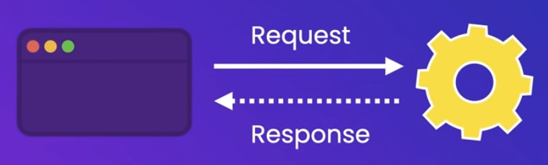
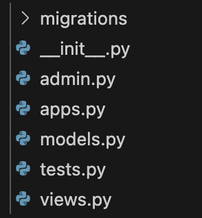

# STOREFRONT

## Notes

###### contents of every app

- admin.py --->
- apps.py --->
- models.py --->
- tests.py --->
- views.py ---> collection of view functions (view function : a function that takes a request and returns a response)
  a.k.a Request Handler

  

###### when a new app is created ...

the new app is required to be registered in the `settings.py` of the main app

## Somthing Useful

- to check the path for Python that is currently in use : execute `which python` command in the terminal
- to create a new app : execute `python manage.py startapp [NAME YOUR APP]` command in the terminal
  it will create a new app with contents such as below;

  

## References

- [Programming with Mosh : Python Django Tutorial for Beginners](https://www.youtube.com/watch?v=rHux0gMZ3Eg&t=867s)
