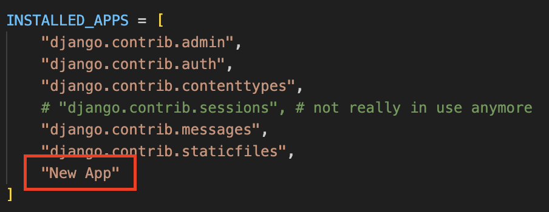

# STOREFRONT

## Notes

#### - **contents of every app**

- admin.py
  - <>
- apps.py
  - <>
- ## models.py
- tests.py
  - <>
- views.py

  - collection of view functions (view function : a function that takes a request and returns a response) a.k.a Request Handler

    

#### - **when a new app is created ...**

the new app is required to be registered in the `settings.py` of the main app

#### - **setting up debugging & debugging Django applications in VSCode in 10 steps**

1. open Run and Debug in the left tool bar
2. click on create a launch.json file
3. select Python from dropdown
4. select Django from dropdown
5. now launch.json file is created in .vscode folder
6. [optional] open launch.json add a random port (such as "9000") in the args to avoid crashing with the port in use (by default "8000")
7. add a break point in the code where the beginning of debugging is required
8. run and debug
9. debug each line of code by step over, step into & step out as required
10. remove the break point once debugging is completed

#### - **organizing data models**

- **MONOLITH** should be avoided --> do **one** thing and do it **well**
- however, breaking up too much might lead too much of coupling and dependencies
- !!! a good design is one with **MINIMAL COUPLING** and **HIGH COHESION** !!!

## Something Useful

- to check the path for Python that is currently in use : execute `which python` command in the terminal
- to create a new app : execute `python manage.py startapp [NAME YOUR APP]` command in the terminal
  it will create a new app with contents such as below;

  

## References

- [Programming with Mosh : Python Django Tutorial for Beginners](https://www.youtube.com/watch?v=rHux0gMZ3Eg&t=867s)
